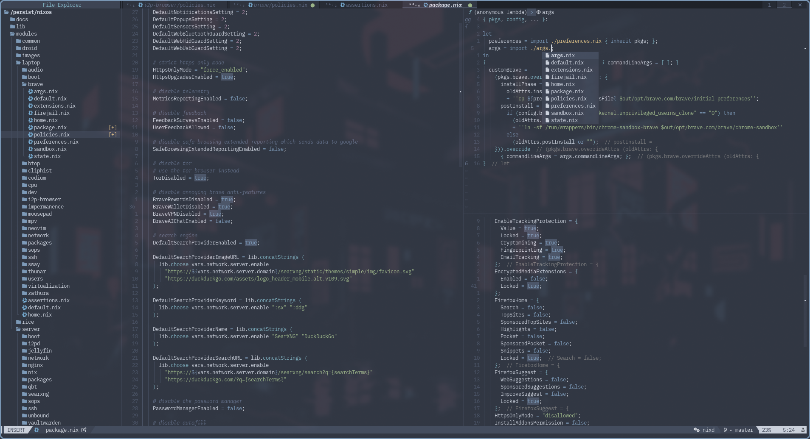

# Neovim Configuration Flake

A modular **Neovim configuration flake** built with [nvf](https://github.com/notashelf/nvf).

Replaces my older nixvim [configuration](https://github.com/sotormd/neovim-nixvim)



## Contents

1. [Features](#features)
2. [Usage](#usage)

## Features

### Core

* Built on **nvf** for declarative, Nix-managed configuration
* **Aliases:** `vi`, `vim`
* **LSP + DAP** support with diagnostics, formatting, and debugger UI
* **Nord** colorscheme with themed statusline (`lualine`)
* **Treesitter** highlighting and context awareness
* **Autopairs**, snippets (`luasnip`), autocomplete (`blink-cmp`)
* **UndoTree**, **Bufferline**, and **Neo-tree** file explorer
* **Telescope** fuzzy finder and **WhichKey** keybinding hints
* **Noice** + **Fidget** for UI polish and status notifications

### Language Support

| Language     | LSP             | Formatter        |
| ------------ | --------------- | ---------------- |
| **Nix**      | `nixd`          | `nixfmt`         |
| **Markdown** | `marksman`      | `deno_fmt`       |
| **Bash**     | builtin         | -                |
| **Go**       | `gopls`         | `gofmt`          |
| **Python**   | `basedpyright`  | `black`, `isort` |
| **Rust**     | `rust-analyzer` | `rustfmt`        |
| **Haskell**  | `hls`           | -                |

Additional diagnostics and Treesitter parsing are enabled for all supported languages.

### UI & Visuals

| Component              | Plugin                                  |
| ---------------------- | --------------------------------------- |
| Statusline             | `lualine`                               |
| Cursorline & Scrollbar | `nvim-cursorline`, `nvim-scrollbar`     |
| Undo & Indentation     | `highlight-undo`, `indent-blankline`    |
| Notifications          | `noice.nvim`, `fidget.nvim`             |
| Breadcrumbs            | `navbuddy`, `illuminate`                |
| Color Highlighting     | `colorizer.nvim`                        |

### Utility & Motion

| Feature                | Plugin                                       | Description                        |
| ---------------------- | -------------------------------------------- | ---------------------------------- |
| Motion                 | `hop.nvim`, `leap.nvim`, `precognition.nvim` | Jump navigation & motion training  |
| Multi-cursor           | `multicursors.nvim`                          | Multiple cursors editing           |
| Split Management       | `smart-splits.nvim`                          | Resize splits easily               |
| Diff & Version Control | `diffview.nvim`                              | Git diff viewer                    |
| Icon Picker            | `icon-picker.nvim`                           | Insert Nerd Font icons             |
| Surround               | `surround.nvim`                              | Edit parentheses/quotes/tags       |
| Undo Tree              | `undotree.nvim`                              | Visual undo history                |
| Image Paste            | `img-clip.nvim`                              | Paste clipboard images in Markdown |
| Terminal               | `toggleterm.nvim`                            | Integrated terminal emulator       |

### Debugging

| Component | Plugin        |
| --------- | ------------- |
| Core      | `nvim-dap`    |
| UI        | `nvim-dap-ui` |

## Usage

Run directly:

```bash
nix run github:sotormd/neovim
```

Or import into another flake:

```nix
inputs.neovim.url = "github:sotormd/neovim";
```

Available packages:

* `neovim.packages.x86_64-linux.default`
* `neovim.packages.aarch64-linux.default`

