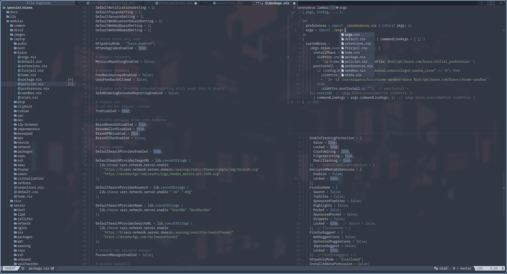

# Neovim Configuration Flake

A modular **Neovim configuration flake** built with
[nvf](https://github.com/notashelf/nvf).

Replaces my older
[nixvim configuration](https://github.com/sotormd/neovim-nixvim).



# Usage

Run directly:

```bash
nix run github:sotormd/neovim
```

Or import into another flake:

```nix
inputs.neovim.url = "github:sotormd/neovim";
```

Available packages:

- `packages.x86_64-linux.default`
- `packages.aarch64-linux.default`
